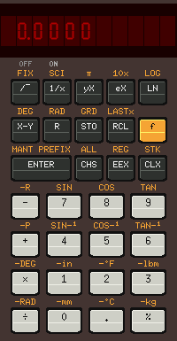
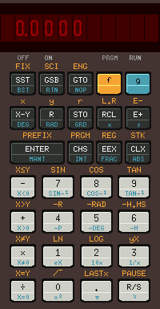

## x11-calc - Another RPN (Reverse Polish) calculator.

  

 

  

Written in C using X11.

Use  of any language extensions or non standard language features has  been
avoided in order to try to make the code as portable as possible.

Currently compiles without modification on Linux, VAX/VMS, and  Tru64 Unix.

### Latest News

17/11 - Compiles without modification on VAX/VMS!

15/11 - Holding down the off switch exits.

### Status

Mostly working, next goal is to be able simulate the HP34C.

##### HP 21 - Working

##### HP 22 - Working
* The examples on pages 65, 66 and 76 only work if END is selected.

##### HP 25 - Working

##### HP 27 - Completed (not tested)

##### HP 29 - Working
* Only saves persistent registers (Note - Breaks compatibility with earlier
versions).

##### HP 31 - Working

##### HP 32 - Completed
* Working but hangs after self test completes

##### HP 33 - Working

### Compiling

To  build the simulator on Linux check that you have all the  prerequisites
installed  then  download the source code from github and unzip it  (a  new
folder  will  be created to automatically).  Then change directory  to  the
new folder run 'make all' to build all the available simulators.

e.g:

    $ wget https://github.com/mike632t/x11-calc/archive/refs/heads/master.zip
    $ unzip master.zip
    $ cd x11-calc-master
    $ make all

    $ ./bin/x11-calc-29
    x11-calc-29: Version 0.4 [Commit ID: 81c55be] 16 Oct 21 21:15:00 (Build: 0067)
    ROM Size : 4096 words

### Keyboard Shortcuts

The following keyboard shortcuts should work on Linux:

'0' - '9', '+'. '-'. '*'. '/' and 'Enter' should do what you expect them to
(when using numeric key pad you need to use numlock as usual).

'Esc' or 'Backspace' is 'Clx', 'c' is CHS, 'e' is 'EEX' and on programmable
models 'Space' corresponds to 'SST'.

'f' and where applicable 'g' and 'h' correspond to the function keys.

'Ctrl-Z'  Quits,  and  'Ctrl-C' does a reset.  For models  with  continuous
memory 'Ctrl-Z' saves the current register contents, and 'Ctrl-C'  restores
them to the original saved state.

### Loading and saving

For  models with continuous memory the contents of program memory and  data
registers are saved in a hidden file in the users' HOME directory when  the
program  exits  or the calculator is switched off, and restored  from  this
hidden file when the simulator is loaded or reset using 'Ctrl&#8209;C'

    ~/.x11-calc-nn.dat

When  starting the simulator the name of the data file used to restore  the
saved state can be specified on the command line allowing previously  saved
copies of programs to be loaded automatically when the simulator starts  or
the  simulator is reset using 'Ctrl&#8209;C'.  However, any changes will be saved
in the hidden data file.

### Exiting

Clicking  on the On/Off switch will turn the simulator on and off,  but  if
you hold down the off switch down for two seconds the program will exit.

### Debugging

You  can  start the simulation in trace mode using '&#8209;t', or in single  step
mode using '&#8209;s', and set a breakpoint using '&#8209;b &lt;octal address&gt;'.

'Ctrl&#8209;T'  also toggles trace mode when running, 'Ctrl&#8209;S' executes the  next
instruction, 'Ctrl&#8209;Q' resumes execution, and 'Ctrl&#8209;R' displays the contents
of the CPU registers .

When in trace mode a jump to the same instruction produces no output.

### Known Issues

On  models with continuous memory the state of all the registers  is  saved
when the simulation is powered off.

On  UNIX/Linux a 24&#8209;bit colour display is required, while on VMS  the
simulator requires a black and white display.

Keyboard shortcuts only work on Linux.

On a Raspberry Pi the display is not updated properly if either FKMS or KMS
graphics overlays are enabled.  The following entries in '/boot/config.txt'
should be commented out as shown.

    #dtoverlay=vc4-fkms-v3d
    #dtoverlay=vc4-kms-v3d

### Tested

- Debian 10 (Buster), GCC 8.3.0, x64

- Debian 10 (Buster), GCC 8.3.0, arm

- Debian 9 (Stretch), GCC 6.3.0, arm

- Debian 5 (Lenny), GCC 4.2.4, alpha

- Fedora 34, GCC 11.2.1, x64

- Ubuntu 20.04, GCC 9.3.0, x64

- VAX/VMS 5.4-3, VAXC 3.2, VAX (simh)

### Prerequisites

The following packages are required to build and/or run the simulator.

- Debian : gcc, make, libx11&#8209;dev, libc6&#8209;dev, xfonts&#8209;base

- Ubuntu : gcc, make, libx11&#8209;dev, libc6&#8209;dev, xfonts&#8209;base

- Fedora : gcc, make, libx11&#8209;dev, libc6&#8209;dev, xorg&#8209;x11&#8209;xfonts&#8209;base

- Gentoo : gcc, make, libx11&#8209;dev, libc6&#8209;dev, font&#8209;misc&#8209;misc
