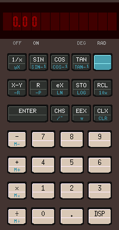
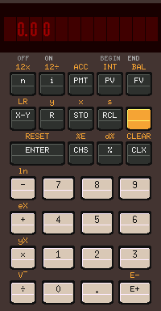
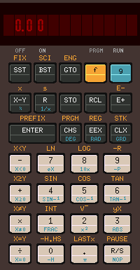
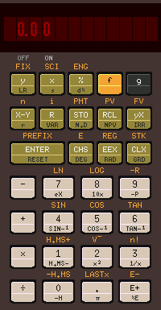
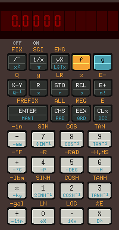

## x11-calc - Another RPN (Reverse Polish) calculator.

   

 

  

Written in C using X11.

Use  of any language extensions or non standard language features has  been
avoided in order to try to make the code as portable as possible. Currently
it will only compile without modification on Linux (Debian 10), but as with
earlier  versions of the intention is to be able to compile the code on VMS
running on either VAX or Alpha processors, and Tru64 Unix running on Alpha.

### Status

Currently very much work in progress. The CPU simulation code is now mostly
complete but several important functions remain to be implemented and it is
likely that the memory data structures will have to be revised.

##### HP21 - Working 

##### HP 22 - Working
The  following issues were observed when checking the behaviour against the
examples in the owners handbook..
* The examples on pages 65, 66 and 76 only work if END is selected.

##### HP 25 - Working
* Not continuous memory.

##### HP 27 - Only keyboard working.

##### HP 29 - Only keyboard working.

##### HP 31 - Work in progress.
* Add support for missing opcodes.
* Implement on/off switch.
* Fix display.

##### HP 32 - Only keyboard working.

##### HP 33 - Only keyboard working.

### Compiling

To  build the simulator on Linux check that you have all the  prerequisites
installed  then  download the source code from github and unzip it  (a  new
folder will be created to hold it automatically).  Then change directory to
the folder containing the source code and run 'make MODEL=nn', where nn  is
a valid model number.

e.g:

    $ wget https://github.com/mike632t/x11-calc/archive/refs/heads/master.zip
    $ unzip master.zip
    $ cd x11-calc-master/src
    $ make MODEL=25
    
    $ ../bin/x11-calc-25
    x11-calc-25: Version 0.2 [Commit ID: d3e8e4b] 14 Oct 21 00:15:42 (Build: 0058)
    ROM Size : 2048 words 

### Keyboard Shortcuts

The following keyboard shortcuts should work:

'0' - '9', '+'. '-'. '*'. '/' and 'Enter' should do what you expect them to
(when using numeric key pad you need to use numlock as usual).

'Esc' is 'Clx', 'c' is CHS, 'e' is 'EEX' and on programmable models 'Space'
corresponds to 'SST'. 

'f' and where applicable 'g' and 'h' correspond to the function keys.

'Ctrl-Z' Quits, and 'Ctrl-C' does a reset.

### Debugging

You  can  start the simulation in trace mode using '-t', or in single  step 
mode using '-s', and set a breakpoint using '-b <octal address>'.

'Ctrl-T'  also toggles trace mode when running, 'Ctrl-S' executes the  next
instruction, 'Ctrl-Q' resumes execution, and 'Ctrl-R' displays the contents
of the CPU registers .  

When in trace mode a jump to the same instruction produces no output.

### Known Issues

Attempting to compile using a later version of 'gcc' will result in several
warning  messages being generated due to the the use of 'ftime()' which has
been deprecated.

Need  to sort out colour mapping to allow program to run on a display  with
less than 24 -bit colour - may get round to this be one day...

The  X11 implementation on the Raspberry Pi 4 is just too slow to draw  the
display without it flickering (but it works well on the Jetson Nano, and an
old Intel Atom based netbook). I suspect that rewriting the display code to
use  a custom font or a fixed size bitmap for each digit instead of drawing
each segment individually might speed things up. 

### Prerequisites

The following packages are required to build and/or run the simulator.

- Debian : gcc, make, libx11-dev, libc6-dev, xfonts-base

- Ubuntu : gcc, make, libx11-dev, libc6-dev, xfonts-base

- Fedora : gcc, make, libx11-dev, libc6-dev, xorg-x11-xfonts-base

- Gentoo : gcc, make, libx11-dev, libc6-dev, font-misc-misc

- Arch   : gcc, make, libx11-dev, libc6-dev, xorg-fonts-misc ?

- Alpine : gcc, make, libx11-dev, libc6-dev, font-misc-misc ?

